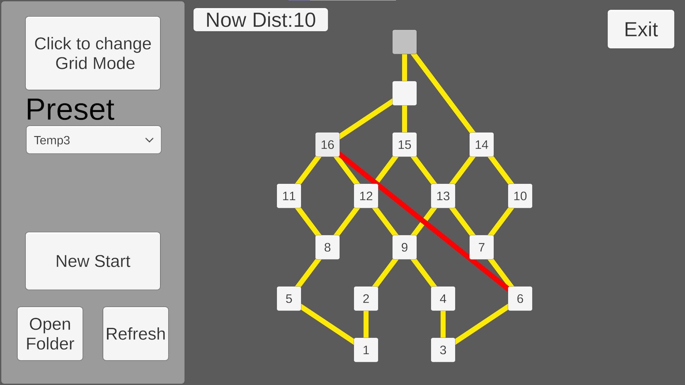
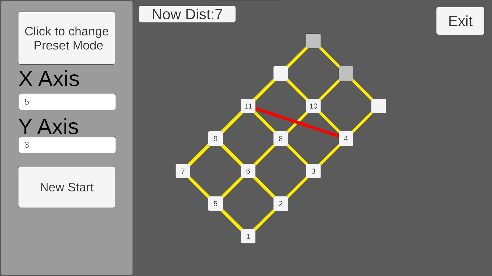
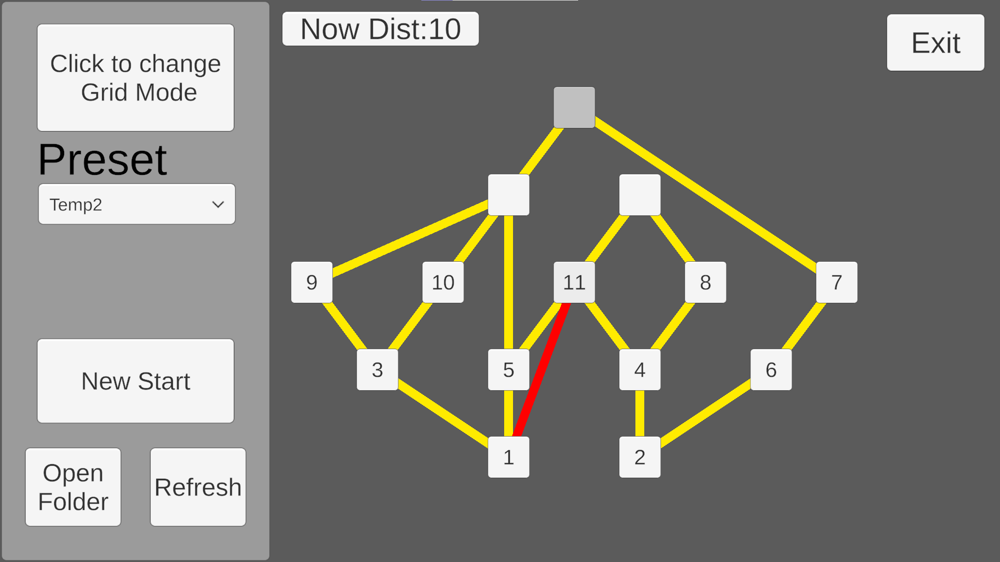

<!-- HERO (centered banner) -->
<h1 align="center">LD Poset Simulator</h1>

<em>A visual tool for simulating, editing, and inspecting finite posets.</em>

  

<table>
  <tr>
    <td></td>
    <td></td>
    <td></td>
  </tr>
</table>

---

## About the Tool
**LD Poset Simulator**는  
유한 partially ordered set(포셋)을 시각화하고,  
노드를 직접 선택하고 Tightness의 계산을 자동으로 처리할 수 있도록 만든  
경량형 연구용 유틸리티 툴입니다.

본래는 격자구조의 Linear Discrepancy 관련 실험용으로 만들어졌지만,  
지금은 일반적인 poset 구조 시각화/검증에도 활용 가능하도록 확장되었습니다.

---

## Features

### 1. 순차 선택(Line-Down) 시각화  
선택 규칙:  
- 아래 레벨이 모두 채워져야 상위 레벨 선택 가능  
- 실험적 LD 시각화 및 단계별 트리거 검증에 적합

### 2. Tightness 계산 및 시각화  
- 포셋 내 edge 구조 기반으로 **tight edge**가 붉은 색으로 하이라이트  
- 연구용 검증 및 패턴 탐색에 활용

### 3. 두 가지 동작 모드  
좌측 상단 모드 토글로 변경:

#### ■ Grid Mode  
격자 구조 기반 poset 자동 생성  
- X, Y 값 입력  
- **New Start** 클릭 → 시각화  
- 단순 구조 실험 및 학습용에 적합

#### ■ Preset Mode  
텍스트 파일 기반 커스텀 poset 로딩  
- 구조가 복잡한 포셋 설계/연구에 적합  
- 파일 입출력 자동 처리  

---

## Controls

| Input | Action |
|-------|--------|
| **Left Click** | 노드 선택, 선택한 노드를 재클릭할 시 해당 노드까지 진행이 되돌아갑니다. | 

---

## Using Preset Mode

왼쪽 하단 UI를 기준으로 설명합니다.

### 1. **Open Folder**
프로그램의 데이터 폴더를 엽니다. Document/PosetSimulator
프로그램이 처음 실행될 때 생성되며,
내부에는 다음 파일들이 있습니다:

- `Template.txt` — 포셋 작성 양식  
- `Temp1.txt ~ Temp4.txt` — 예시 포셋 프리셋  

### 2. **Template.txt를 보고 포셋 작성**
양식은 단순합니다.
\# NodeCount
int
\# edges
From-To
From-To

※ `%`로 시작하는 줄은 주석.

### 3. **Refresh 버튼**
폴더에 있는 `.txt` 파일들을 다시 읽어옵니다.  
- 파일명이 데이터 키가 됩니다  
- 파싱 성공 시 poset이 갱신됩니다  

### 4. **Log 기능**
서식이 틀린 경우:
- `log.txt` 가 폴더 내에 자동 생성됨  
- 오류 라인 번호 포함합니다.

### 5. **Template 재생성 기능**
`Template.txt`를 삭제했다면:

- 해당 폴더를 삭제 → 프로그램 재실행  
- Template.txt & Temp 프리셋들이 자동으로 다시 생성됨  

---

## Development Purpose

이 프로젝트는 본래  
**Linear Discrepancy 및 포셋 구조 분석을 시각적으로 실험하기 위한 연구 도구**로 시작되었습니다.

특징적인 목표들은 다음과 같습니다:

- 수학적 실험을 GUI 기반으로 빠르게 반복할 수 있는 환경 구축  
- 복잡한 포셋도 TXT 기반으로 간단히 표현하도록 설계  
- Tightness, Branching Structure 등을 직관적으로 이해할 수 있게 만드는 것  
- 연구자/학생/개발자가 poset을 쉽게 실험하고 테스트하도록 만드는 것  

Unity를 활용하여 시각적 표현과 실시간 갱신이 쉽기 때문에  
실험 속도를 높이고 직관적인 분석을 지원하는 방향으로 제작하였습니다.

